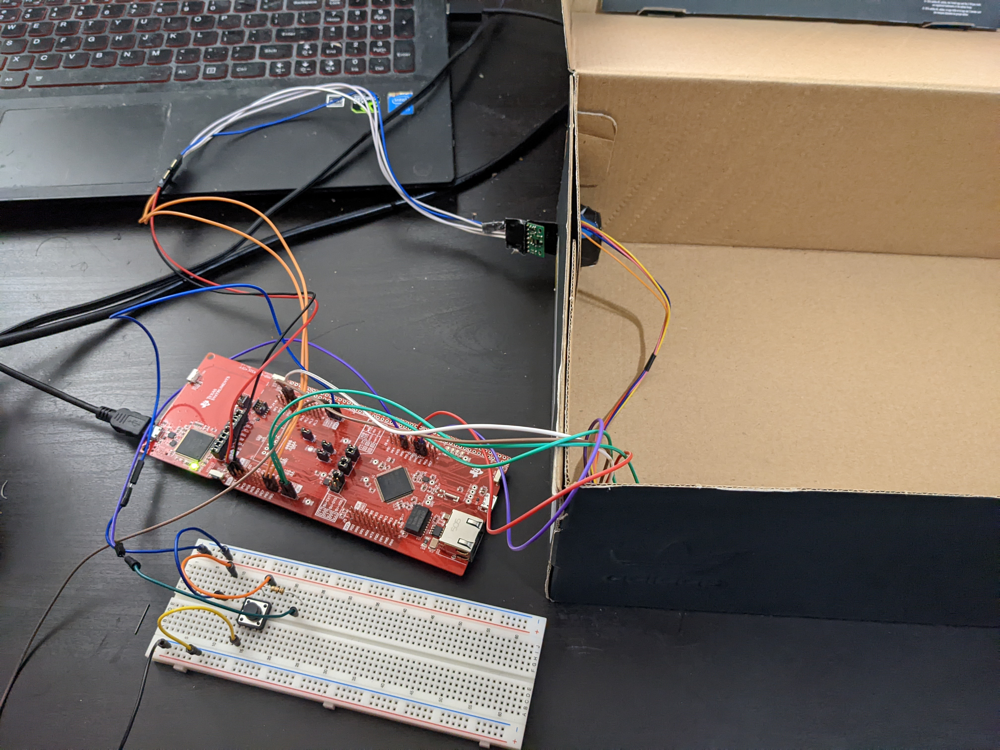
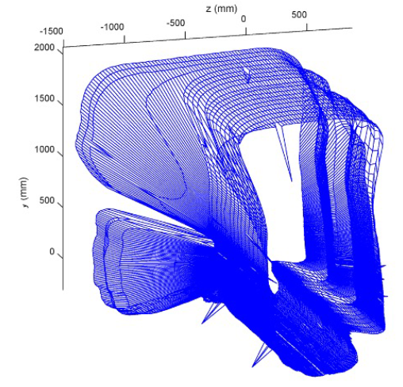

# Spacial Mapping System

## Table of contents

- [Overview](#overview)
  - [The challenge](#the-challenge)
  - [Screenshot](#screenshot)
- [My Process](#my-Process)
  - [Built with](#built-with)
  - [Code Snippets](#code-Snippets)
  - [What I learned](#what-i-learned)

## Overview

### The challenge
- Design and build an embedded spatial measurement system using a time-of-flight sensor to acquire
information about the area around you. Using a rotary mechanism to provide a 360 degree measurement
of distance within a single vertical geometric plane (e.g., y-z). 

- Mapped spatial information is stored in onboard memory and later communicated to a personal computer or web application for reconstruction and graphical presentation.

### Screenshot

#### Spacial Mapping Device
Consists of MSP432E401Y Microcontroller,  VL53L1X Time of Flight (ToF) sensor, Stepper Motor, and Active Low Push Button


#### Hallway Reconstruction
Using Python OpenGL library to reconstruct data



## My process
Our microcontroller will serve as a bridge between communicating with our time of flight sensor
and our computer. The time of flight sensor itself will be attached to a stepper motor
rotating in both clockwise and counterclockwise direction to get spatial distance
measurements(y-z plane). It will rotate a total of 3 times with each rotation representing a 360°
surface later to be visualized on our personal computer. It is able to get these distance
measurements by emitting light using a photon emitter and the time it takes to come back to it
after bouncing off a surface.The time of flight sensor itself contains all the analog to digital
conversion such as transduction, signal conditioning and analog to digital conversion. Our
microcontroller communicates with our time of flight sensor using I2C protocols to get distance
measurements from the sensor. The data is then communicated to our personal computer using
UART to receive these data measurements. We will use python as our method of visualization of
our data readings on our computer. Using Pyserial we read the data from UART and store the
coordinates of our distance measurements. We then use Open3D to visualize these data points in
a 3D environment to get an accurate depiction of the environment. It is important to note that we
take these distance measurements assuming the user will move forward for every scan that is
taken with there being 3 scans in total

### Built with

- Python: OpenGL,Pyserial
- C:  Extracting Distance Measurements, I2C Communication, UART Communication
- Assembly: System Clock Setting, Port Configurations
- SimpleLink MSP432E401Y Microcontroller
- Stepper Motor, Time of Flight Sensor, Breadboard, Resistors

### Code snippets
#### Port Inialization for Push Button
```C
void PortJ_Init(void){ //ON-BOARD PSUH BUTTON
	SYSCTL_RCGCGPIO_R |= SYSCTL_RCGCGPIO_R8;					// activate clock for Port J
	while((SYSCTL_PRGPIO_R&SYSCTL_PRGPIO_R8) == 0){};	// allow time for clock to stabilize
  GPIO_PORTJ_DIR_R &= ~0x02;    										// make PJ1 in 
  GPIO_PORTJ_DEN_R |= 0x02;     										// enable digital I/O on PJ1
	
	GPIO_PORTJ_PCTL_R &= ~0x000000F0;	 								//  configure PJ1 as GPIO 
	GPIO_PORTJ_AMSEL_R &= ~0x02;											//  disable analog functionality on PJ1		
	GPIO_PORTJ_PUR_R |= 0x02;													//	enable weak pull up resistor
}
```

#### Initialize I2C protocalls to communicate with Time-of-Flight Sensor
```C
void I2C_Init(void){
  SYSCTL_RCGCI2C_R |= SYSCTL_RCGCI2C_R0;           													// activate I2C0
  SYSCTL_RCGCGPIO_R |= SYSCTL_RCGCGPIO_R1;          												// activate port B
  while((SYSCTL_PRGPIO_R&0x0002) == 0){};																		// ready?

    GPIO_PORTB_AFSEL_R |= 0x0C;           																	// 3) enable alt funct on PB2,3       0b00001100
    GPIO_PORTB_ODR_R |= 0x08;             																	// 4) enable open drain on PB3 only

    GPIO_PORTB_DEN_R |= 0x0C;             																	// 5) enable digital I/O on PB2,3
//    GPIO_PORTB_AMSEL_R &= ~0x0C;          																// 7) disable analog functionality on PB2,3

                                                                            // 6) configure PB2,3 as I2C
//  GPIO_PORTB_PCTL_R = (GPIO_PORTB_PCTL_R&0xFFFF00FF)+0x00003300;
  GPIO_PORTB_PCTL_R = (GPIO_PORTB_PCTL_R&0xFFFF00FF)+0x00002200;    //TED
    I2C0_MCR_R = I2C_MCR_MFE;                      													// 9) master function enable
    I2C0_MTPR_R = 0b0000000000000101000000000111011;                       	// 8) configure for 100 kbps clock (added 8 clocks of glitch suppression ~50ns)
//    I2C0_MTPR_R = 0x3B;                                        						// 8) configure for 100 kbps clock
        
}

```

#### On Board Port Inialization to serve as OFF button
```C
void PortM_Init(void){      //USED FOR OFF BUTTON(PM0)
	//Use PortM pins for output
	SYSCTL_RCGCGPIO_R |= SYSCTL_RCGCGPIO_R11;				// activate clock for Port M
	while((SYSCTL_PRGPIO_R&SYSCTL_PRGPIO_R11) == 0){};	// allow time for clock to stabilize
	GPIO_PORTM_DIR_R |= 0x00	;        								// making PM0 an input  
  GPIO_PORTM_AFSEL_R &= ~0xFF;     								// disable alt funct on PN0
  GPIO_PORTM_DEN_R |= 0xFF;        								// enable digital I/O on PN0
																									
  GPIO_PORTM_AMSEL_R &= ~0xFF;     								// disable analog functionality on PN0		
	return;
}
```

#### Stepper motor rotation functions using half-stepping method
```C
void spin_Clockwise()						//function to spin clockwise 45 degrees
{
		for(int i=0; i<64; i++){						//one full rotation through full stepping takes 2048 steps
			GPIO_PORTH_DATA_R = 0b00001001;			//therefore 1/8 of rotation is 45 deg is 256 steps
			SysTick_Wait10ms(2);								//since we have 4 steps in the loop, i= 256/4 = 64
			GPIO_PORTH_DATA_R = 0b00000011;
			SysTick_Wait10ms(2);
			GPIO_PORTH_DATA_R = 0b00000110;
			SysTick_Wait10ms(2);
			GPIO_PORTH_DATA_R = 0b00001100;
			SysTick_Wait10ms(2);
	}
}

void spin_CounterClockwise()						//function to spin clockwise 45 degrees
{
		for(int i=0; i<64; i++){						//one full rotation through full stepping takes 2048 steps
			GPIO_PORTH_DATA_R = 0b00001100;		//therefore 1/8 of rotation is 45 deg is 256 steps
			SysTick_Wait10ms(2);							//since we have 4 steps in the loop, i= 256/4 = 64
			GPIO_PORTH_DATA_R = 0b00000110;
			SysTick_Wait10ms(2);
			GPIO_PORTH_DATA_R = 0b00000011;
			SysTick_Wait10ms(2);
			GPIO_PORTH_DATA_R = 0b00001001;
			SysTick_Wait10ms(2);
		}
}
```

#### Extracting distance measurements via I2C and UART Communication
```C

	// Get the Distance Measures 8 times
	int counter = 0;
	while(counter < 3){ // 3 SCANS
		if(GPIO_PORTJ_DATA_R == 0b00000000){
			counter++;
			for(int i = 0; i < 8; i++) {       //EXTRACT 8 MEASUREMENTS
				
				if((GPIO_PORTM_DATA_R&0b00000010)==0){
					counter = 10; // stop taking measurements/rotating
					break;
				}
				else{
				}
				
				//wait until the ToF sensor's data is ready
				while (dataReady == 0){
					status = VL53L1X_CheckForDataReady(dev, &dataReady); // check if data has
					VL53L1_WaitMs(dev, 5);
				}
				
				dataReady = 0;
				status = VL53L1X_GetDistance(dev, &Distance);					//VALUE OF R

				if(direction%2==0){  // avoid entanglement
					spin_Clockwise();	
					FlashLED1(1);
				}else {
					spin_CounterClockwise();
					FlashLED1(1);					
				}
						
				status = VL53L1X_ClearInterrupt(dev); /* clear interrupt has to be called to enable next interrupt*/
				
				// print the resulted readings to UART (SEEN IN PYTHON SHELL)
				sprintf(printf_buffer,"%u\n",Distance);
				UART_printf(printf_buffer);
				SysTick_Wait10ms(50);
			}
		}else{
			SysTick_Wait10ms(50);
		}
		direction++; //  allow to rotate CW/CCW
	}
  
	VL53L1X_StopRanging(dev); /// stop sensor
  while(1) {}

}
```


